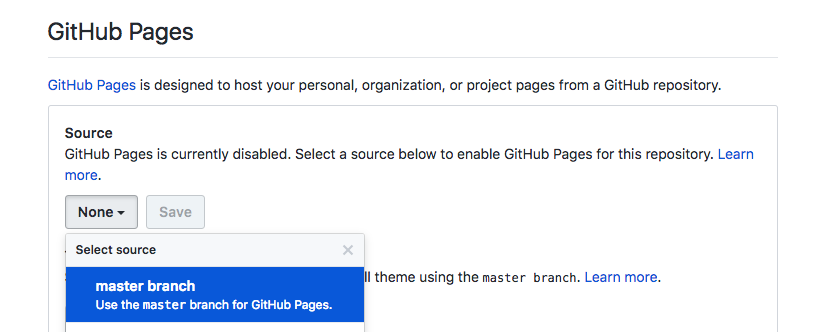

# Your first homepage :seedling:

After [signing up for your own GitHub](https://github.com/join) account,
please complete the following steps to create and host your first personal homepage.

## Create your homepage

1. **Fork** this repository
2. Inspect the `index.html` page
3. Follow the `### TODO ###` instructions there:
    - fill in your name in the `<title>` and the `<header>`
    - write a personal introduction
    - write out your personal motivations for joining the course
    - edit the social media links so they point to your accounts
4. Add a photo (see below)

## Host your homepage

1. Go to the ⚙️ **Settings** tab on your GitHub project repository.
2. Scroll down until you see the heading "Github Pages"
3. Under "Source" select `master branch`

## That's it!

After a few minutes your homepage will be available at
`https://<your-github-username>.github.io/cn-homepage/`. You can also see the
link set in the "Github Pages" section.

Congratulations for creating and hosting your first homepage! : )

---

### Tips for adding a photo
For adding a picture to your homepage, you can either:
- link to a URL that shows a picture of you that is already online
- upload a picture and link to it (e.g. on [Imgur](https://imgur.com/))
- upload an image to your forked GitHub repository and link to the *relative URL*
(this means simply writing the image name only, e.g.: `src="my_photo.jpg"`)

---

### Challenge: Customize your homepage
As you can see, this website is pretty bare-bones. There are a lot of customizations
that you can work on if you are interested in that. Completing the tasks above
is enough for this exercise (you just got a page up on the internet!!! 🎉).

In this course we will mostly be working on the **back end** side of the web.
This means we'll learn about what makes all this magic possible more than working
on making the **front end** - the user facing part - look great.

We do this because we are learning about **software development** using Python.
Creating the front-end of websites requires different languages - first and foremost
HTML and CSS. These are _not programming languages_, but they are still _formalized
languages_.

It is not very difficult to learn the basics of these languages, but again - this
will not be the focus of this course.

However, if you want to dive in deeper and create a beautiful visually unique experience,
please **do** go ahead! There are countless great tutorials on beginning front-end
web development out there, and you'll be able to pick up the basics of HTML and CSS
pretty quickly.

Here are some useful links if you want to give it a try:

- [W3Schools](https://www.w3schools.com/) as an interactive reference for HTML, CSS and more
- [Codecademy's Web Development courses](https://www.codecademy.com/catalog/subject/web-development)
(scroll down to the free "Courses" section)
